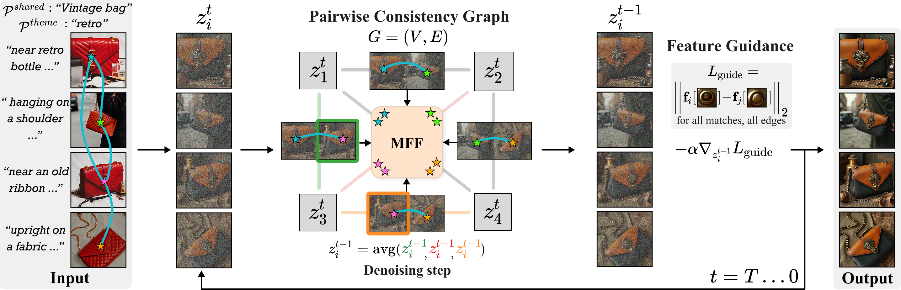
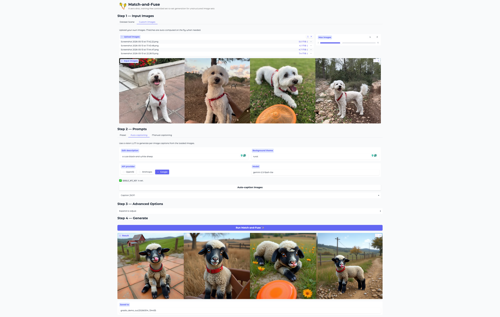

<div align="center">

<h1>Match-and-Fuse: Consistent Generation from Unstructured Image Sets</h1>

[](https://arxiv.org/abs/2511.22287)
[](https://match-and-fuse.github.io/)
[](https://cvpr.thecvf.com/virtual/2026/poster/36587)
[](https://pypi.org/project/dino-matchsim/)

[Kate Feingold](https://www.linkedin.com/in/katefeingold/) &nbsp;·&nbsp;
[Omri Kaduri](https://omrikaduri.github.io/) &nbsp;·&nbsp;
[Tali Dekel](https://www.weizmann.ac.il/math/dekel/home)


Match-and-Fuse is a zero-shot, training-free method for consistent controlled generation of unstructured image sets — collections that share a common visual element, yet differ in viewpoint, time of capture, and surrounding content.

</div>

---

<div align="center">

**Contents:** [Method](#method) · [Installation](#installation) · [Data Setup](#data-setup) · [Running](#running) · [Gradio Demo](#gradio-demo) · [Evaluation](#evaluation) · [DINO-MatchSim](#dino-matchsim) · [Citation](#citation)

</div>

---

## Method



Three components plug into the FLUX denoising loop:

| Component | What it does                                                                                                                                     |
|---|--------------------------------------------------------------------------------------------------------------------------------------------------|
| **Pairwise Consistency Graph** | The image set is modeled as a graph, each edge pairs two images for joint denoising on a shared canvas, activating the *grid prior*.             |
| **Multiview Feature Fusion (MFF)** | Each image's features are aggreagred with the features of matched locations in other images, consolidating appearance across the graph.          |
| **Feature Guidance** | At each denoising step, latents are refined with a gradient-descent step minimizes a feature-level matching objective. |


## Installation

```bash
conda create -n match-and-fuse python=3.10 -y
conda activate match-and-fuse
git clone https://github.com/kate-feingold/match-and-fuse.git
cd match-and-fuse
pip install torch torchvision --index-url https://download.pytorch.org/whl/cu124  # adjust to your CUDA version
pip install -r requirements.txt
huggingface-cli login  # for gated FLUX.1 [dev] weights
```
Download the [Depth Anything V2 checkpoint](https://huggingface.co/depth-anything/Depth-Anything-V2-Metric-Hypersim-Large/resolve/main/depth_anything_v2_metric_hypersim_vitl.pth) and place it in `checkpoints/`.


## Data Setup

Downloads and resizes images, and computes pairwise matches in one script:
```bash
# images + precomputed matches (faster inference)
./scripts/prepare_data.sh --dataset all --matches
```
`--dataset` accepts `dreambooth`, `customconcept101`, or `all`.

`--matches` can be omitted to auto-compute them on the fly during inference.

See [data/README.md](data/README.md) for more details on data structure.


## Running

```bash
# General command after `./scripts/prepare_data.sh`
 python main.py --images data/images/<dataset>/<scene>/ --captions_path data/benchmark_captions/<scene>_p<id>.json --save_path results/my_edit

# Read-to-run example
python main.py --images data/images/sample_pet_cat1/ --captions_path data/benchmark_captions/pet_cat1_p1.json --save_path results/my_edit
```

Or generate captions on the fly with a VLM:

```bash
# set a key depending on --caption_model
export OPENAI_API_KEY=sk-...       # gpt-* models
export ANTHROPIC_API_KEY=sk-...    # claude-* models
export GOOGLE_API_KEY=...          # gemini-* models

python main.py --caption_model gpt-4o --prompt_shared "a marble statue" --prompt_theme "autumn" ...
```

- `--images` accepts a folder or a list of files (`--images img1.png img2.png img3.png`)
- `--caption_model` accepts any OpenAI, Anthropic, or Gemini model. The provided captions can serve as a reference for writing your own, see [data/README.md](data/README.md).
- `--matches_dir` is optional: matches are auto-discovered inside `data/`, or computed on the fly if not found.
- `--flowedit` enables inversion-free localized editing (requires source prompts in the captions JSON).


## Gradio Demo



A local UI for running the method on data/ scenes or custom images.

```bash
python gradio_demo.py
# → http://localhost:5001
```

## Evaluation

```bash
python eval.py --dir results/my_edit/
```

Computes DINO-MatchSim (multi-view consistency) and T2I/LongCLIP-L (alignment with prompts auto-detected from `captions.json`).

| Method                               | CLIP ↑ | DreamSim ↑ | DINO-MatchSim ↑ |
|--------------------------------------|---|---|---|
| FLUX Kontext                         | 0.65 | 0.78 | 0.57 |
| IC-LoRA                              | 0.65 | 0.71 | 0.65 |
| FLUX                                 | 0.67 | 0.76 | 0.66 |
| Edicho                               | 0.65 | 0.81 | 0.72 |
| **Match-and-Fuse (ours)**            | **0.66** | **0.85** | **0.80** |
| &nbsp;&nbsp;&nbsp;w/o Pairwise Graph | 0.66 | 0.82 | 0.75 |
| &nbsp;&nbsp;&nbsp;w/o MFF            | 0.66 | 0.83 | 0.78 |
| &nbsp;&nbsp;&nbsp;w/o Feat Guidance  | 0.66 | 0.82 | 0.76 |


## DINO-MatchSim

DINO-MatchSim is also available as a standalone pip package — see [`dino_matchsim/README.md`](dino_matchsim/README.md) for more details.
```bash
pip install dino-matchsim[bg]
```


## Citation

```bibtex
@inproceedings{matchandfuse2026,
  title     = {Match-and-Fuse: Consistent Generation from Unstructured Image Sets},
  author    = {Feingold, Kate and Kaduri, Omri and Dekel, Tali},
  booktitle = {Proceedings of the IEEE/CVF Conference on Computer Vision and Pattern Recognition (CVPR)},
  year      = {2026}
}
```


## Acknowledgments
We thank the following projects that were used for the codebase:
- [x-flux](https://github.com/XLabs-AI/x-flux) — FLUX and ControlNet
- [Depth Anything V2](https://github.com/DepthAnything/Depth-Anything-V2) — depth condition extraction
- [RoMa](https://github.com/Parskatt/RoMa) — dense matching implementation
