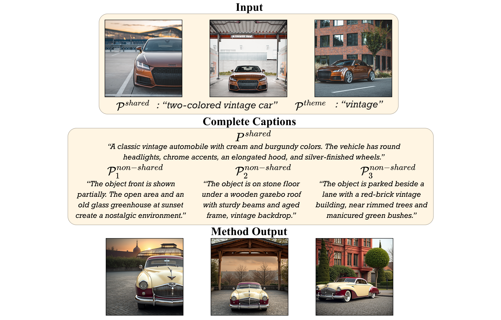

# Benchmark Data

Images, pairwise matches, and per-edit captions used to evaluate Match-and-Fuse.

```
data/
  images/                               ← source images, center-cropped and resized
  matches/                              ← precomputed RoMa pairwise matches
  benchmark_captions/{scene}_p{n}.json  ← one file per scene × edit variants
```

Images and matches are not stored in the repo. Set them up with:

```bash
./scripts/prepare_data.sh --dataset all --matches
```

This downloads [DreamBooth](https://github.com/google/dreambooth) and [CustomConcept101](https://github.com/adobe-research/custom-diffusion), prepares the images, and computes pairwise matches.

Re-running is safe: already-prepared data is skipped.

## Captions



Each captions file contains prompts for one scene edit, generated by querying GPT-4o with the input images, short target shared prompt and theme. The VLM interprets them into a detailed shared prompt and per-image pose and background descriptions. 

To write your own captions, see [`benchmark_captions/cat_p1.json`](benchmark_captions/cat_p1.json) for a full example. The `src` and `per_image_non_shared_src` fields are only required for `--flowedit` and can be omitted otherwise.
