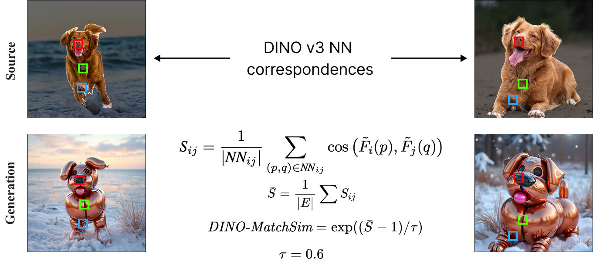

# DINO-MatchSim

[](https://arxiv.org/abs/2511.22287)
[](https://match-and-fuse.github.io/)
[](https://pypi.org/project/dino-matchsim/)

Multi-view consistency metric proposed in **"Match-and-Fuse: Consistent Generation from Unstructured Image Sets"**.

## Installation

```bash
pip install dino-matchsim[bg]

# Without foreground segmentation
pip install dino-matchsim
```

## Usage

```python
from PIL import Image
from dino_matchsim import dino_matchsim_score, DinoMatchSimCfg, BgCfg

input_images  = [Image.open(p) for p in input_paths]   # before edit
output_images = [Image.open(p) for p in output_paths]  # after edit

results = dino_matchsim_score(
    input_images, output_images,
    cfg=DinoMatchSimCfg(tau=0.6, sim_thresh=0.5),  # optional
    bg_cfg=BgCfg(remove_bg=True),                  # optional
    viz_dir="overlays/",                           # optional: save match overlays
)
print(results["dino_matchsim_output"])  # consistency score in (0, 1]
print(results["dino_matchsim_input"])   # baseline (input upper bound)
```

See `DinoMatchSimCfg` and `BgCfg` for all options.

## How it works



1. Computes patch-level DINOv3 features from the input (pre-edit) images.
2. Builds foreground-filtered mutual nearest-neighbour correspondences across all image pairs.
3. Measures feature similarity at those fixed correspondence locations in the output (post-edit) images.
4. Returns `exp((S̄ − 1) / τ)` where `S̄` is the mean cosine similarity — **higher is more consistent**.

## Citation

If you use this metric, please cite:
```bibtex
@inproceedings{matchandfuse2026,
  title={Match-and-Fuse: Consistent Generation from Unstructured Image Sets},
  author={Feingold, Kate and Kaduri, Omri and Dekel, Tali},
  booktitle={Proceedings of the IEEE/CVF Conference on Computer Vision and Pattern Recognition (CVPR)},
  year={2026}
}
```